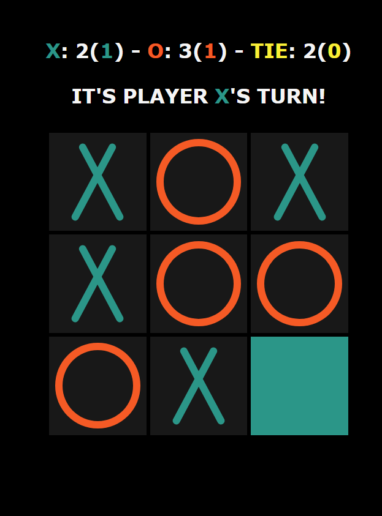
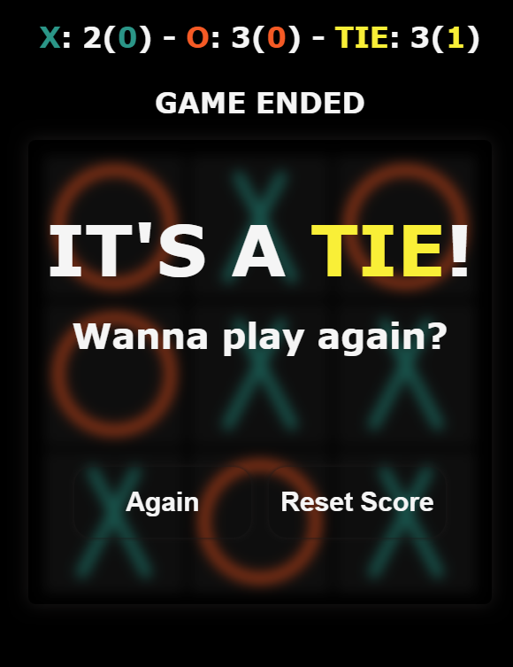
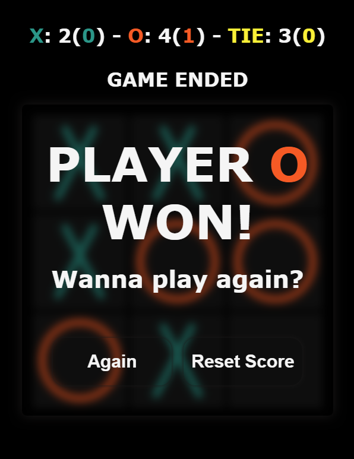

# **TicTacToe**

-   Try out **[HERE](https://m0hanad1.github.io/Portfolio/)**.
-   Simple TicTacToe game made with **`HTML`**, **`CSS`**, and **`JavaScript`**.
-   The game contains some **`Animations`**, **`Effects`**, and **`Score System`**.
-   The game supports **`Tab Navigation`**.
-   The score system got **`Temporarily Score`** and **`Permanent Score`**.

## **Examples**

